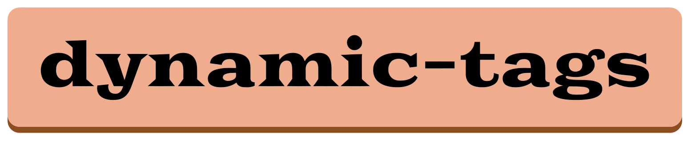

<link href="https://fonts.googleapis.com/css2?family=Goblin+One&family=Gotu&family=DM+Mono:wght@300&family=Poppins:wght@300;400&display=swap" rel="stylesheet">

<h1 align="center">
  
   
   
  
   
   
</h1>
 

dynamic-tags
 is a library designed to supercharge your already existing DOM elements. Just assign any unique CSS class to your tags, and we take care of the rest.

## Demos

  
   
   
  

## Feature roadmap
- [x] implement "input" filter method
- [x] implement autocomplete algorithm for input filter
- [x] add more customizable selectors
- [x] add optional default css styling
- [x] add tab-to-autocomplete feature to input filterSelectionMethod
- [ ] allow config options for autocomplete/search box
  - strict matching (both)
  - match start only (search box)
- [ ] allow for complicated sub-container structure without breaking functionality

## Maintainers
- [Shailesh Vasandani](https://www.github.com/svasandani)
- [Juily Vasandani](https://github.com/juilyvasandani)
